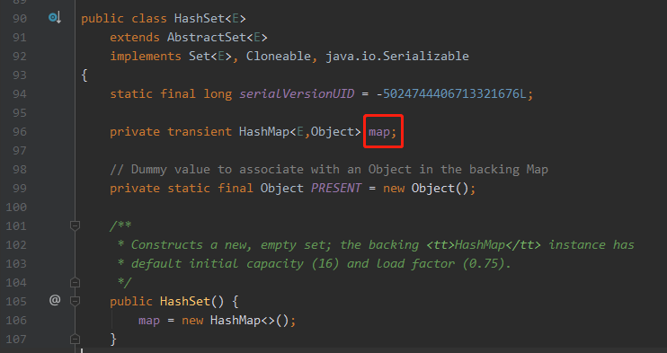

# Set


## 目标 - 用于复习检测

1. `set` 与 `map` 的区别
2. `hashset` 和 `hashmap` 的关系

## 总结 - 用于巩固

### 基础总结



#### set 与 map 的区别

从概念上讲，[Set](http://en.wikipedia.org/wiki/Set_(mathematics)) 是事物的集合，而 `Map`是键到值的映射。

### hashset 和 hashmap 的关系

本质上讲 hashset 和 hashmap 是两种完全不同的数据结构

除了 `HashSet` 在实现上几乎全部都使用了 `HashMap` 属性/方法, 如迭代器, `add()`

```java
public Iterator<E> iterator() {
    return map.keySet().iterator();
}
// PRESENT 是一个静态对象
public boolean add(E e) {
    return map.put(e, PRESENT)==null;
}

```

#### LinkedHashSet

继承了 `hashset`,  内部由 `LinkedHashMap` 实现

```java
// dummy 仅仅是为了区别构造器不同
HashSet(int initialCapacity, float loadFactor, boolean dummy) {
	map = new LinkedHashMap<>(initialCapacity, loadFactor);
}
```

#### TreeSet 和  TreeMap

在实现上, `TreeSet` 和  `TreeMap` 的关系, 就如 `HashSet `和` HashMap` 的关系

